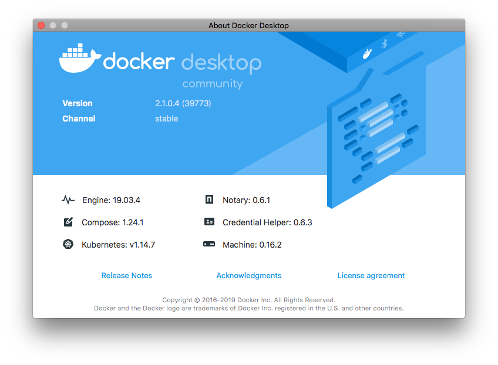
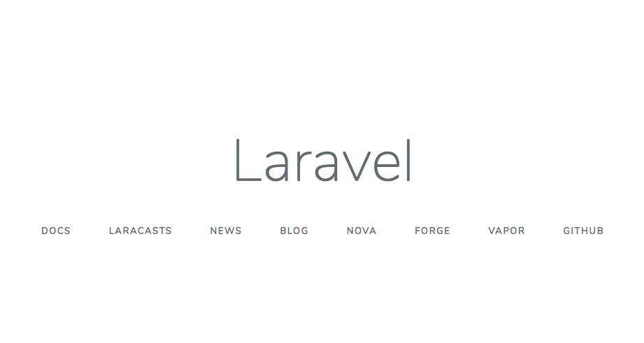
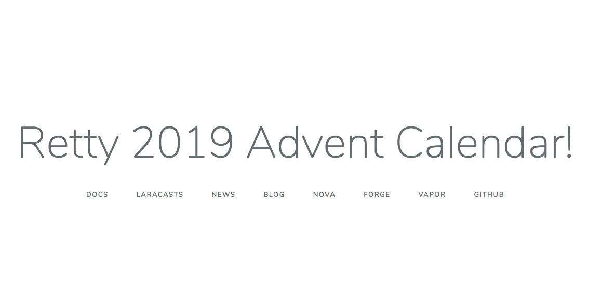
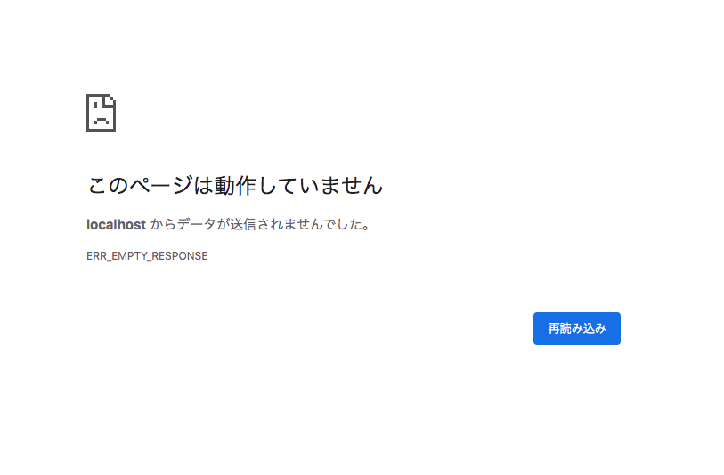

# このリポジトリについて
このリポジトリはRetty Advent Calendar 11日目の記事である [`KubernetesでVolumeトリックを行う方法`]() のサンプルコードとなります。  
まずは上記の記事を参照した上で、このリポジトリをcloneして下記の検証手順に沿って記事の内容を確認していってもらえたらと思います。

# 検証手順
## 前提
まずはこのリポジトリを希望のディレクトリにcloneしてください。  
また各節のコマンド説明はcloneしたディレクトリのトップ(説明上は `/path/to/directory` と記載しますが、それをご自身の環境に読み替えてください)を起点に実行している前提とします。

```shell
$ cd /path/to/directory
$ git clone git@github.com:saku/2019-advent-calendar.git
```

また各ツールのバージョンは以下となっております。



## ファイル構成

```
.
├── LICENSE								ライセンス文（MITです）
├── README.md							このファイル
├── application
│   ├── Dockerfile
│   ├── docker-compose.base-title.yml	docker-composeでを使わない基本イメージの例
│   ├── docker-compose.change-title.yml	docker-composeでVolumeトリックの検証する際の例
│   ├── ...
│   └── （その他はcomposerのファイル）
└── kubernetes
    ├── application.yml
    ├── application_only_hostpath.yml
    ├── application_test_only_file_mount.yml
    └── application_volume_trick.yml
```

## localのdocker-composeでVolumeトリックの検証
### 基本的なイメージの実行
まずはもともとのイメージを立ち上げます。
下記のコマンドを実行して動かしてみましょう。

```shell
$ cd /path/to/directory/application
$ docker-compose -f docker-compose.base-title.yml up
```

成功すると [`localhost:18000`](http://localhost:18000) にアクセスしたときに下記のように表示されるはずです。



確認が終わったら`Control+C`で環境を終了します。

### Volumeトリックを使った実行
次はVolumeトリックを使った例で実行してみましょう。
下記のコマンドを実行して動かします。

```shell
$ cd /path/to/directory/application
$ $ docker-compose -f docker-compose.change-title.yml up
```

成功すると [`localhost:18000`](http://localhost:18000) にアクセスしたときに下記のように表示されるはずです。



確認が終わったら`Control+C`で環境を終了します。

## localのKubernetesでVolumeトリックの検証

### 事前準備
この節のサンプルを実行する前にまずは動作に必要なyamlファイルの生成を行います。
yamlファイルには絶対パスも入ってくるため、下記のコマンドを実行してサンプル用のyamlファイルを生成します。

```shell
$ cd /path/to/directory/kubernetes
$ sh generate.sh
```

### 基本的なイメージの実行
まずはもともとのイメージをKubernetesで立ち上げます。
下記のコマンドを実行して動かしてみましょう。

```shell
$ cd /path/to/directory/kubernetes
$ kubectl apply -f application.yml
deployment.extensions/2019-advent-calendar created
service/advent-calendar created
```

作成されたら下記のコマンドでアクセスするためのポート番号を取得します。

```shell
$ kubectl get svc
NAME              TYPE        CLUSTER-IP      EXTERNAL-IP   PORT(S)        AGE
advent-calendar   NodePort    10.102.35.245   <none>        80:31735/TCP   61s
kubernetes        ClusterIP   10.96.0.1       <none>        443/TCP        3h22m
```

上記のように出力された場合、[`localhost:31735`](http://localhost:31735) にアクセスすると下記のように表示されます。


### 誤ったVolumeトリックを使った実行
次に単純なVolumeマウントだけを書いた場合にKubernetesで実行するとどうなるかを見てみましょう。
下記のコマンドを実行して動かします。

```shell
$ cd /path/to/directory/kubernetes
$ kubectl apply -f application_only_hostpath.yml
Warning: kubectl apply should be used on resource created by either kubectl create --save-config or kubectl apply
deployment.extensions/2019-advent-calendar configured
Warning: kubectl apply should be used on resource created by either kubectl create --save-config or kubectl apply
service/advent-calendar configured
```

作成されたら下記のコマンドでアクセスするためのポート番号を取得します。
（serviceのポート番号は実行ごとに変わるため、その部分は読み替えて実行してください）

```shell
$ kubectl get svc
NAME              TYPE        CLUSTER-IP      EXTERNAL-IP   PORT(S)        AGE
advent-calendar   NodePort    10.102.35.245   <none>        80:31735/TCP   6m
kubernetes        ClusterIP   10.96.0.1       <none>        443/TCP        3h22m
```

再度アクセスしてみますが、ページが表示されなくなるはずです。



podの情報を取得してlogを出してみましょう。
（pod の名前は実行ごとに変わるため、その部分は読み替えて実行してください）

```shell
$ kubectl get pods
NAME                                    READY   STATUS   RESTARTS   AGE
2019-advent-calendar-6699485b89-xh8mm   0/1     Error    3          58s

$ kubectl logs 2019-advent-calendar-6699485b89-xh8mm
Warning: require(/app/src/vendor/autoload.php): failed to open stream: No such file or directory in /app/src/artisan on line 18

Fatal error: require(): Failed opening required '/app/src/vendor/autoload.php' (include_path='.:/usr/local/lib/php') in /app/src/artisan on line 18
```

今回のVolumeトリックの対象である `vendor` ディレクトリがないせいでエラーが出ており、podが起動していないことがわかります。

### 正しいVolumeトリックを使った実行
次に正しいVolumeマウントを使った場合を見てみましょう。
下記のコマンドを実行して動かします。

```shell
$ cd /path/to/directory/kubernetes
$ kubectl apply -f application_volume_trick.yml
deployment.extensions/2019-advent-calendar configured
service/advent-calendar unchanged
```

作成されたら下記のコマンドでアクセスするためのポート番号を取得します。
（serviceのポート番号は実行ごとに変わるため、その部分は読み替えて実行してください）

```shell
$ kubectl get svc
NAME              TYPE        CLUSTER-IP      EXTERNAL-IP   PORT(S)        AGE
advent-calendar   NodePort    10.102.35.245   <none>        80:31735/TCP   12m
kubernetes        ClusterIP   10.96.0.1       <none>        443/TCP        3h22m
```

上記のように出力された場合、[`localhost:31735`](http://localhost:31735) にアクセスすると下記のように表示されます。


